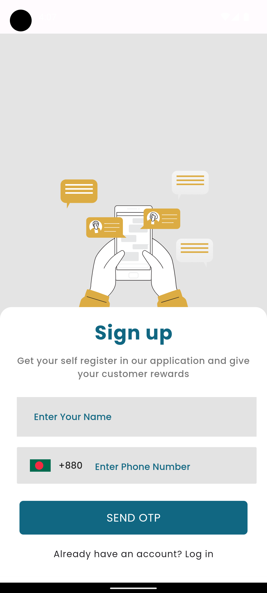
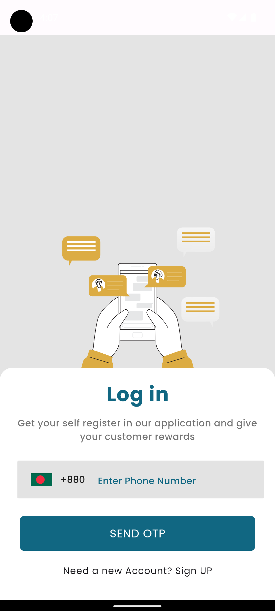
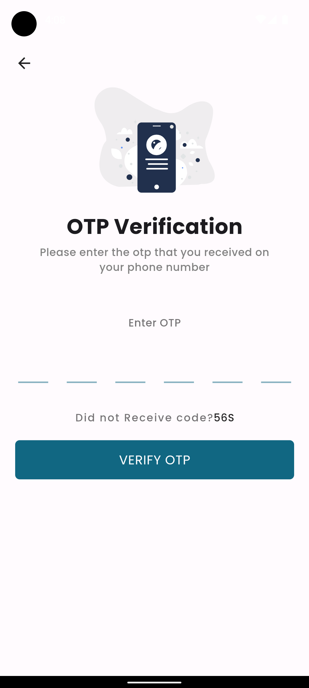
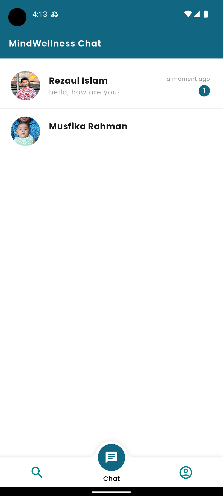
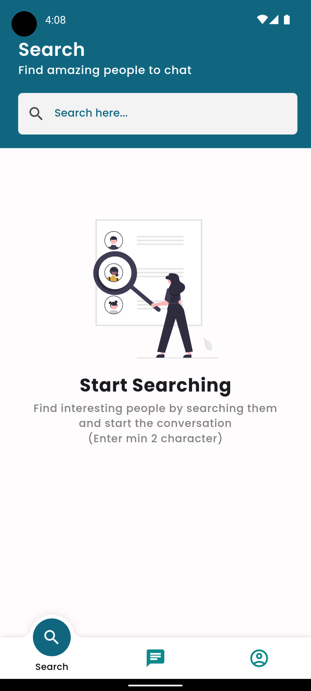
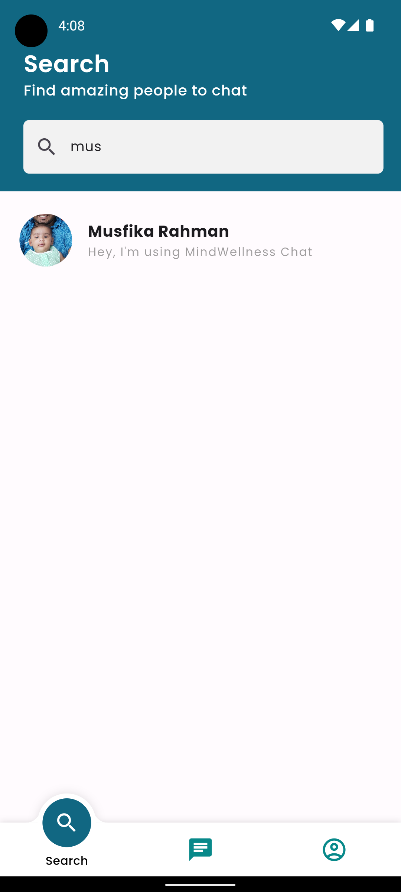
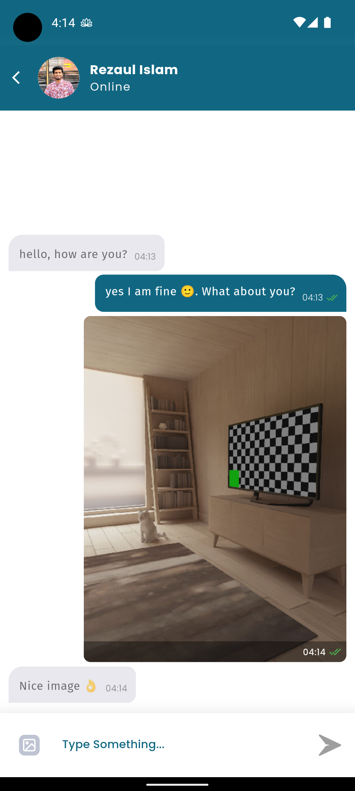
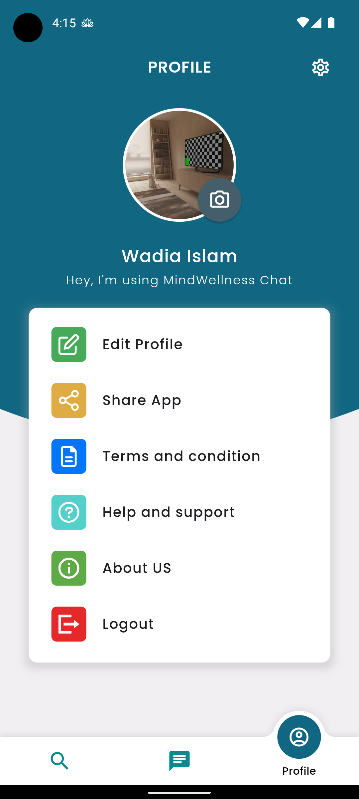
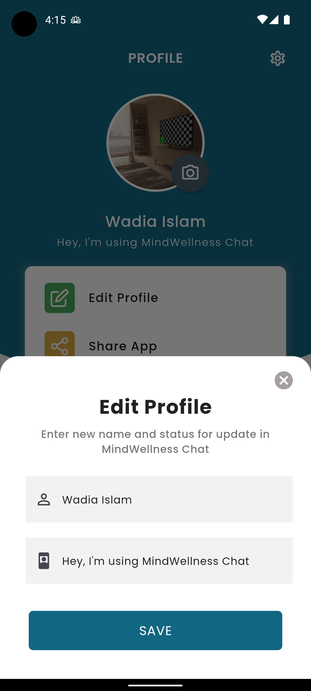

# 🌟 Mind Wellness Chat 🌟
### A chat application built using Node.js, express, socket.io, mongodb atlas, firebase and flutter.

## Features
- Interactive UI interface like whatsapp
- Offline caching of chat messages
- Backup restore of chat messages on new device
- Real-time chat with realtime online and typing indicator
- Message sent, delivered and read status with time
- Phone OTP based authentication and authorization
- User profile with name, profile picture and status update
- Search other users and start chat with them
- Image sharing on chat with image preview
- Emoji support in chat
- Auto download of messages on connecting
- Recent chat feature
- Notification on new message when app is in background or closed

## Screenshots
|       |     |       |
|:---------------------------------:|:------------------------------:|:------------------------------:|
|  |   |   |
|         |  |  |

## Video Demo
[](https://www.loom.com/share/7e4e0c20a3a74bdd939ac795cad609d8?sid=55f5325d-8861-449f-8e25-c66c0b0955c4)

## Technology Used
### Backend
- Nodejs
- Express
- Socket.io
- Mongodb Atlas
- Firebase
- JWT
- Dockerized deployment

### Frontend
- Flutter
- Firebase
    - OTP authentication
    - Cloud storage for image storage
    - Cloud messaging for push notifications
- Provider
- Socket.io client
- Dio
- Database
    - Shared Preferences
    - Drift database for offline caching
- Image
    - Image cropper
    - Image compressor
- MVVM architecture
- GetX for navigation and state management
- Material UI

### Future Scope
- Group chat
- Message reactions
- Voice messages
- Message deletion
- Message forwarding
- Chat archiving
- User blocking
- etc

## Backend Installation
### Docker Installation
- Clone the repository to your local machine.
- Install docker and docker-compose on your machine.
- Create a `.env` file in the root directory of the backend repository and add the following environment variables.
  ```
  NODE_LOCAL_PORT=6868
  NODE_DOCKER_PORT=8080
  MONGO_DB_ATLAS_URL=<mongodb atlas connection string>
- Run the backend server by running `docker-compose up`
- The backend server will be running on `http://localhost:6868` for local development
- The backend server will be running on `http://localhost:8080` for dockerized deployment

### Manual Installation
- Clone the repository to your local machine.
- Install the necessary dependencies by running `npm install` for backend repositories.
- Add google firebase service account json file named `serviceAccount.json` in the root directory of the backend repository.
- Create a `.env` file in the root directory of the backend repository and add the following environment variables.
  ```
  NODE_LOCAL_PORT=6868
  NODE_DOCKER_PORT=8080
  MONGO_DB_ATLAS_URL=<mongodb atlas connection string>
- Run the backend server by running `npm start`
- The backend server will be running on `http://localhost:6868`

## Frontend Installation
- Clone the repository to your local machine and open in android studio or visual studio code.
- Create env file with name `.env` at root of this project.
- Paste your backend URL in env file as shown below.
  ```
  BASEURL=[YOUR_BACKEND_URL]
- Change package name if you want.
- Create a firebase project and add `google-services.json` file in the `android/app` directory and `GoogleService-Info.plist` file in the `ios/Runner` directory.
- Install the necessary dependencies by running `flutter pub get` for frontend repositories.
- Run the frontend application by running `flutter run`
- The frontend application will be running on your connected device or emulator.
- You can also build the apk by running `flutter build apk` or `flutter build ios` for ios.

### Notes
- I have used `Mongodb Atlas` because of this is a fully managed system meaning you do not have to worry about the `maintenance`, `upkeep`, `uptime`, `servicing` or `updates`. But, I am also comfortable using Mongodb locally.
- I have used Firebase for OTP authentication and push notifications. We can also use own backend for OTP authentication and push notifications service.
- I have used firebase cloud storage for image storage and implement like a way so that we can store images in any cloud storage like S3 and get the URL of the image and store it in the database. Cloud storage is used because it is scalable, secure and very cost-effective.

## Improvement & known issues
- Test cases are not written for the backend and frontend.
- UI can be improved and more features can be added.
